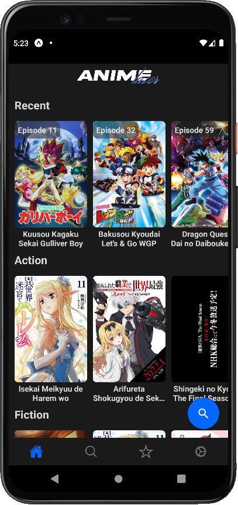
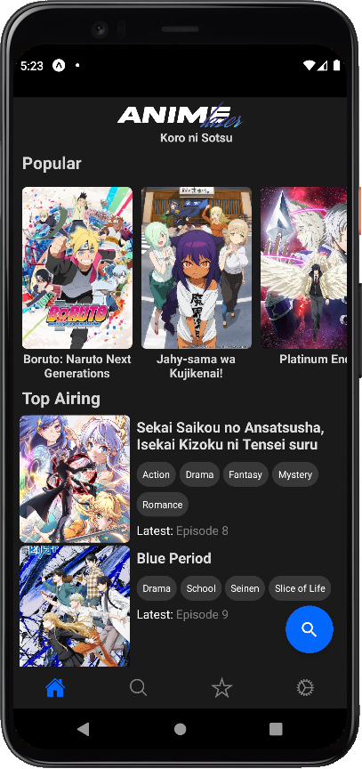
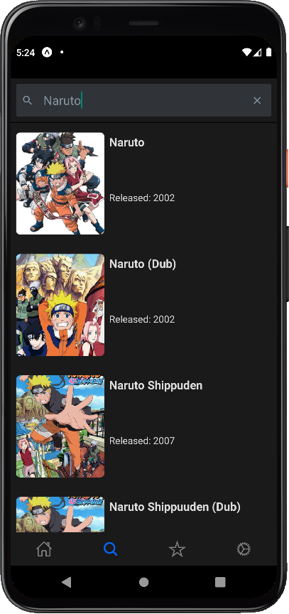
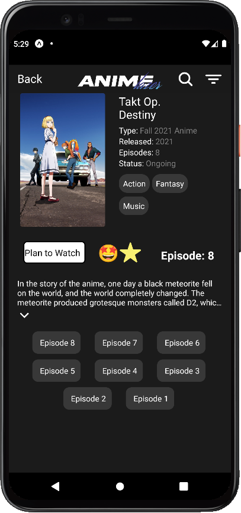
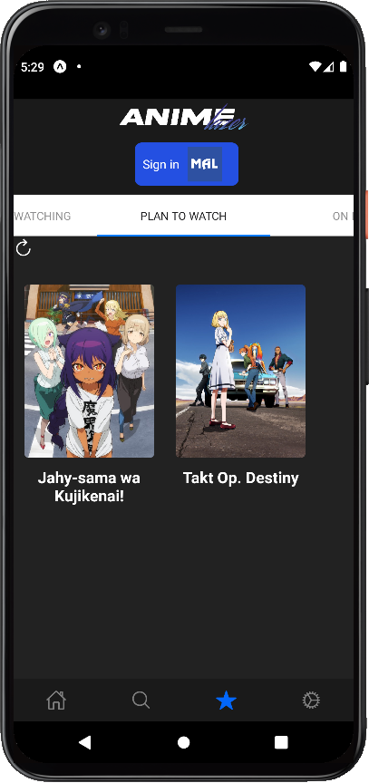
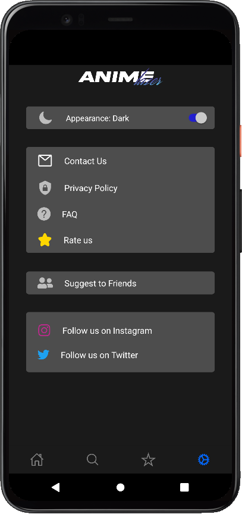
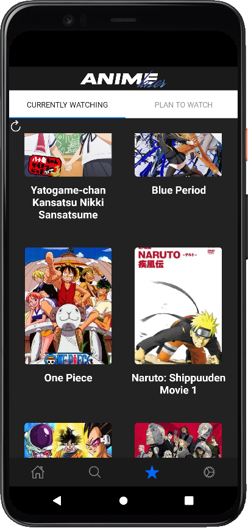
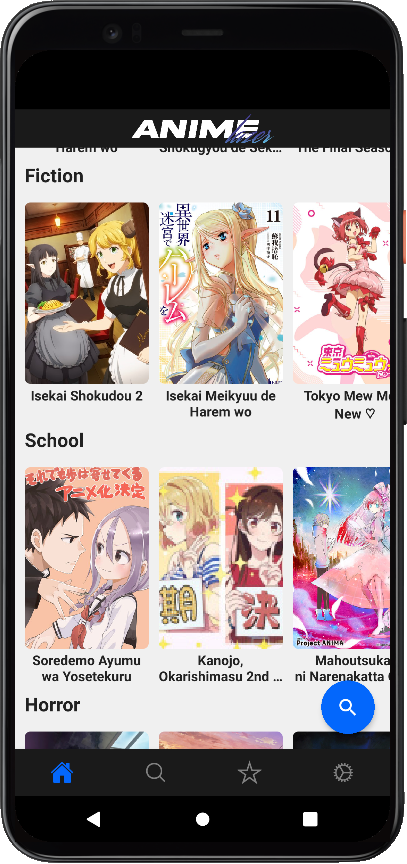

<h2 align="center"><b>Anime Lazer</b></h2>

<h4 align="center">An Android and IOS app to watch anime on your phone without ads.</h4>

<h5 align="center">Download coming soon...(maybe)</h5>

## Screenshots

## Features

- Recent Anime Release.
- Popular Anime.
- Top Airing Anime.
- Horror Anime.
- Fiction Anime.
- Action Anime.
- Search Anime.
- Add to favorites.
- Sign into My Anime List.
- Update MAL list.
- Episode progress.
- Ad free.

## Technologies used

- Javascript
- React Native
- React Navigation
- Expo
- SQLite
- Express
- Axios
- Puppeteer
- Cheerio
- Jsonwebtokens
